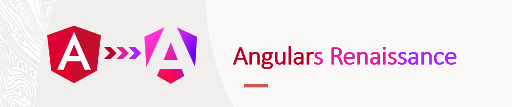

 

# Ng New - The Angular Renaissance
* By Kobi Hari (27/08/2025)

## Contact me
Please feel free to contact me for questions, or just to 
have a chat :-)
- Kobi Hari - hari@applicolors.com

## Material 

|   |    |  
|-------------- | -------------- 
| Our Projects    | [here](./projects)     |
| Our Presentation    | [here](./presentation/Ng%20New.pdf)     |

## The `inject` function
* How to Inject using the function
* What is the **Injection Context** and how it affects using the function
* Where can we, and where can we not, use the `inject` function
* Creating our own injection context using `runInInjectionContext`
* The `DestroyRef` and how it is used

## The new `standalone` paradigm
* Understanding standalone component
* Bootstrapping applications without modules
* Importing providers in the new paradigm  
* **NEW Angular 19**
  * Now - you also provide the `APP_INITIALIZER` using `provideAppInitializer`
  * `standalone:true` no longer neccessary. (actually, you now need `standalone:false` for non-standalone items)

## Routing in the standalone paradigm
* Understanding Environment injetors
* The 2 types of lazy loading: `loadComponent` and `loadChildren`
* Control flow in Angular 17
* Lazy loading using `@defer`
* Directive Composition
* Router inputs
* Functional Guards
* Functional Resolvers

## Signals in Angular 16+
* What is a signal
* The `signal` function
* The `computed` function
* The `set` and `update` functions
* The `effect` function
  * Effects are a little different in Angular 19
* Where can we create signals
* The limitations of using signals
* **NEW** in angular 19 - `linkedSignal`

## The new Angular APIS (17+) (On the route to zoneless)
* Signals slowly replace the classic angular decorators
* use `readonly caption = input('hello')` to create an input called `caption' with a default value of 'hello'
* use `readonly caption = input.required<string>()` to create a required input
* use the `output` function to create an output event emitter that is also a signal
* use the `model` function to create a two-way binding (input + output)
  * You can use it like input and respond to changes in it using an effect
  * You can use it like output and push events into it
  * The consumer can use 3 types of bindings into it: 
    * `<app-comp [caption]="value"/>`
    * `<app-comp (captionChanged)="doSomething()"/>`
    * `<app-comp [(caption)]="writeableSignal"/>`
* use the `viewChild()`, `viewChildren`, `contentChild`, `contentChildren` functions to query the view and content into a signal

## Async development and signals
### Interoperability with rxjs
* convert an observable into signal with the `toSignal` function
* convert a signal into observable with the `toObservable` function
* Use them both with caution - mind the injection context

### **NEW** The resource APIs in Angular 19 and 20
* The `resource` api bridges to `Promise` apis
  * Use a signal as trigger
  * Run a `Promise` function when the trigger emits
  * Tackles cases of race conditions like in a `switchMap` similar behavior
  * Supports cancellation using `AbortSignal`
  * Allows local values as well
  * Allows to "reload" the same trigger value
  * Exposes the latest value, status, error, isLoading
* The `rxResource` api bridges to `Observable`
  * No need for `AbortSignal` since observables natively support cancellation
  * Only receives the first result of every observable
  * Apart from that - is exactly the same as `resource`
* The `httpResource` as a shortcut for http requests

